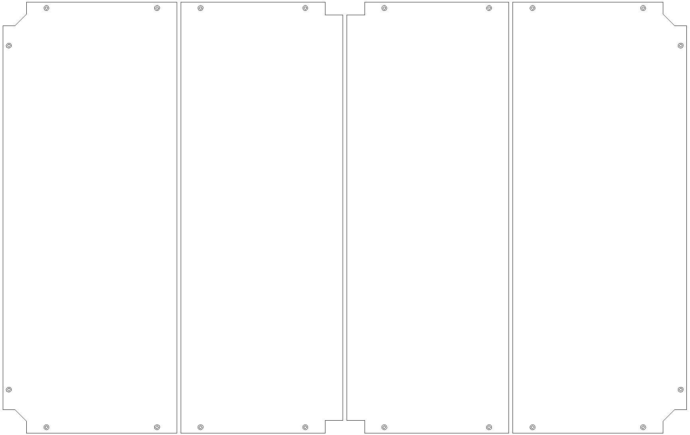
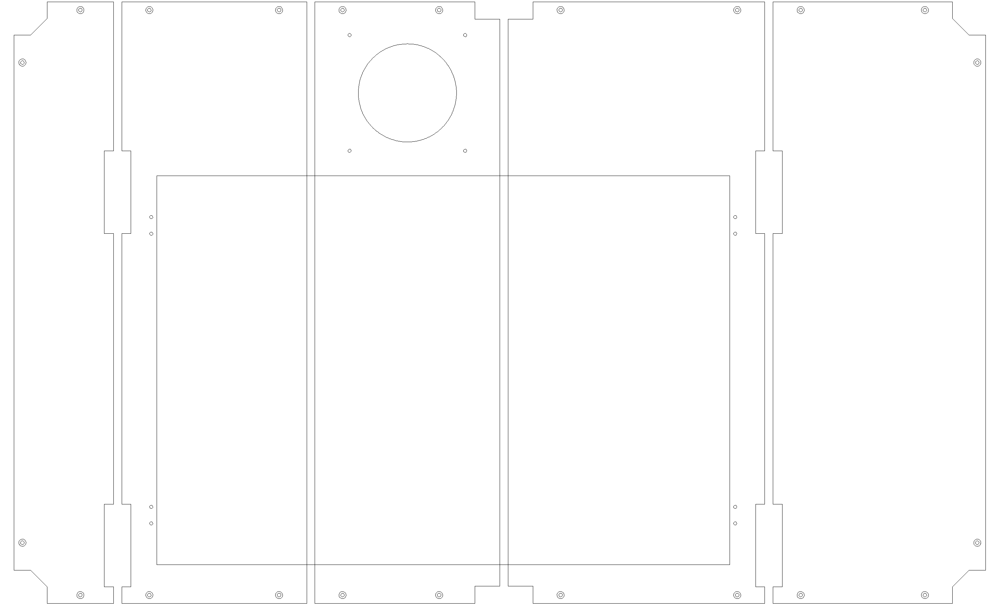
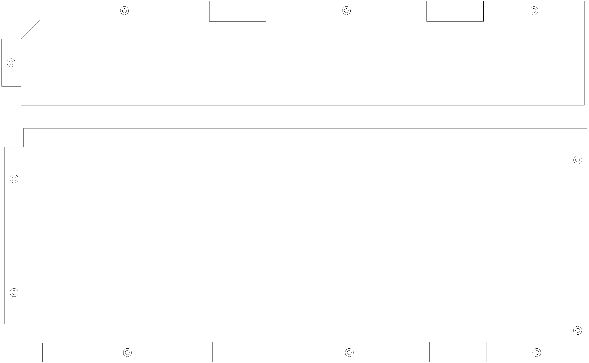
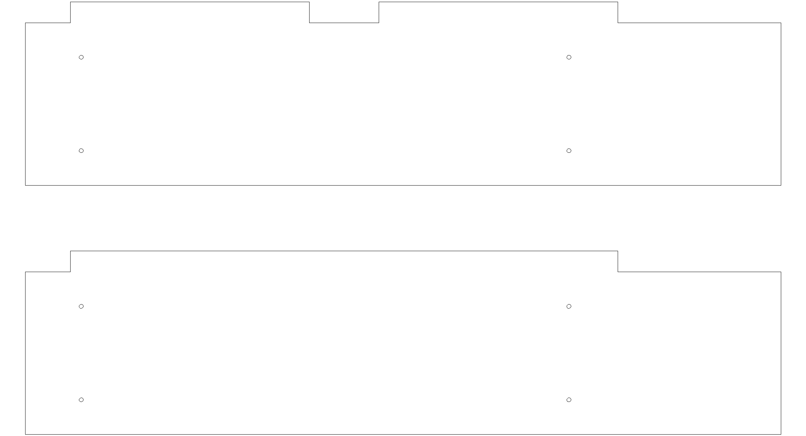

Custom design parts
===========================

The following MDF and ABS custom parts were all designed and made in-house. DXF design files and linuxcnc gcode and files can be found online at https://bitbucket.org/iorodeo/lasercutter/.

Design: MDF floors and interiors
-------------------------------------------
The floors and interior side walls for the laser cutter are made using 1/4" thick `medium-density fiberboard <http://en.wikipedia.org/wiki/Medium-density_fibreboard>`_ (MDF). We used two 4' x 8' sheets to make a total of 
13 individual routed parts: lower floor (4), middle floor (5), upper floor (2) and interior side walls (2).
MDF sheets were purchased from local lumber store, Ganahl lumber (approx. $ per sheet). Shown below are some images of the designs.

Lower floor
^^^^^^^^^^^^^^^^

Middle floor
^^^^^^^^^^^^^^^^^^^^^^^^^^

Upper floor
^^^^^^^^^^^^^^^^^^^^^^^^^^

Interior walls
^^^^^^^^^^^^^^^^^^^^^^^^^^

   
Design: ABS frame covers
-------------------------------------------

Coming soon .........