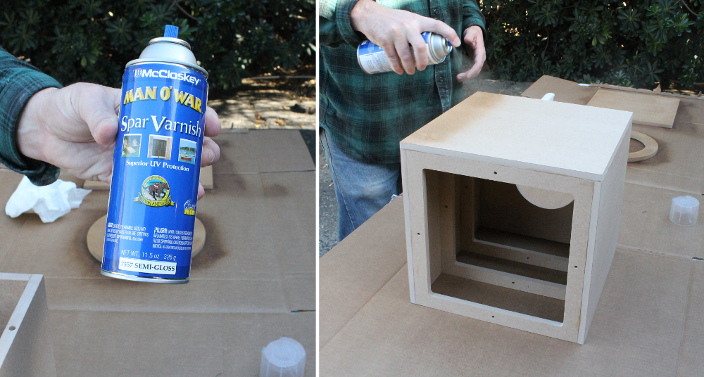
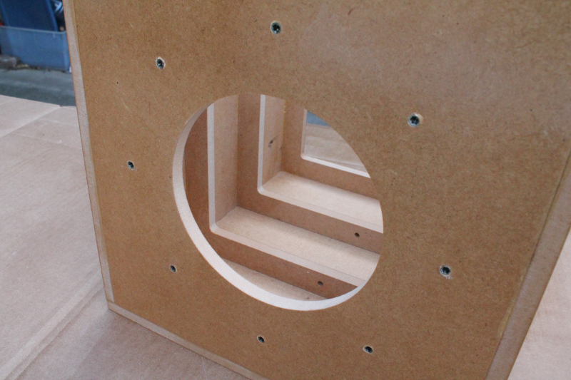
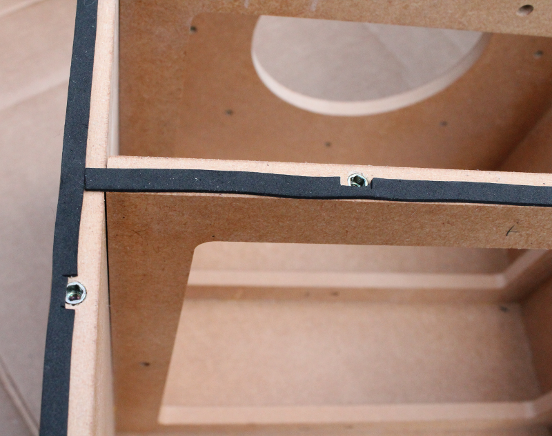
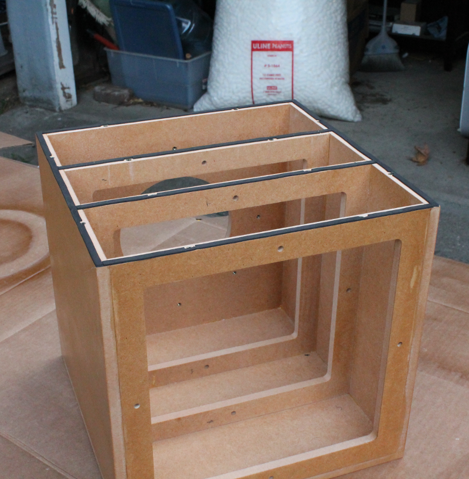
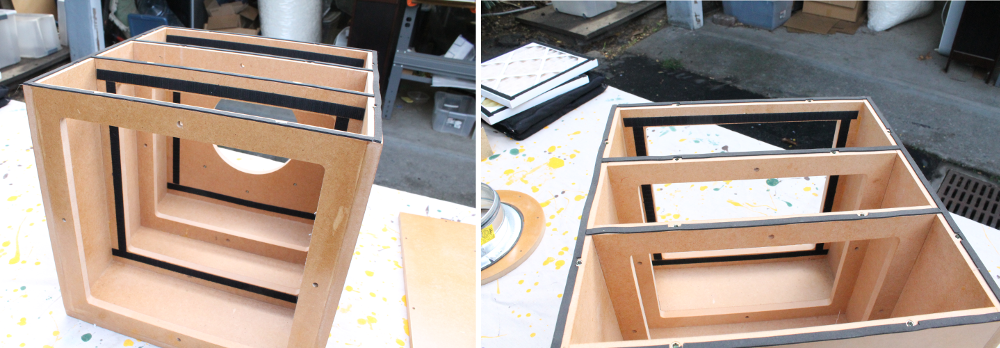

Building the HEPA filter box - Part 2
========================================

Varnishing the box
----------------------------------------

Spray exterior and interior with 2-3 coats of Spar varnish.

   

Thread inserts, foam tape and velcro
----------------------------------------

Install the 20 x 8-32 thread inserts 
   

   
Place adhesive-backed foam along the edges of the top.   

   
Apply velcro to the inside of the box 

