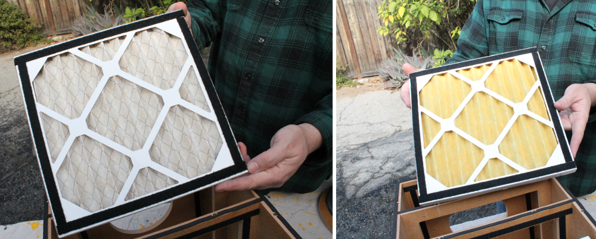

Installing filters into the box
====================================

Filter components
------------------------

Installing the air filter panels
------------------------------------
   
Tape velcro to the air filter panels 
^^^^^^^^^^^^^^^^^^^^^^^^^^^^^^^^^^^^^^^^^^^^^^^^^^^^^^^^^^^^^^^^^^^^^^^^^^^^^^^^^^^^^^^^^^^^^^^^^^^^^^^^^

   
   
Press the air air filters panels into the box making sure to orient the panels in the right direction 
^^^^^^^^^^^^^^^^^^^^^^^^^^^^^^^^^^^^^^^^^^^^^^^^^^^^^^^^^^^^^^^^^^^^^^^^^^^^^^^^^^^^^^^^^^^^^^^^^^^^^^^^^

.. figure:: _static/velcro_6.png
   :align:  center

   
   
   
Installing the activated charcoal filters
---------------------------------------------

Apply velcro to the charcoal bags and press them into the box 
^^^^^^^^^^^^^^^^^^^^^^^^^^^^^^^^^^^^^^^^^^^^^^^^^^^^^^^^^^^^^^^^^^^^^^^^^^^^^^^^^^^^^^^^^^^^^^^^^^^^^^^^^

Image of box so far
^^^^^^^^^^^^^^^^^^^^^^^^^^^

.. figure:: _static/velcro_10.png
   :align:  center

   
Installing the HEPA filter
---------------------------------------------

Insert the HEPA filter panel into the middle of the filter box
^^^^^^^^^^^^^^^^^^^^^^^^^^^^^^^^^^^^^^^^^^^^^^^^^^^^^^^^^^^^^^^^^^^^^^^^^^^^^^^^^^^^^^^^^^^^^^^^^^^^^^^^^

.. figure:: _static/hepa_1.png
   :align:  center

Image of box with all filter panels installed
^^^^^^^^^^^^^^^^^^^^^^^^^^^^^^^^^^^^^^^^^^^^^^^^^^^

.. figure:: _static/hepa_2.png
   :align:  center
   
   
   
   
