Custom frame floors and interior walls
=======================================

Machining the MDF with CNC router 
------------------------------------

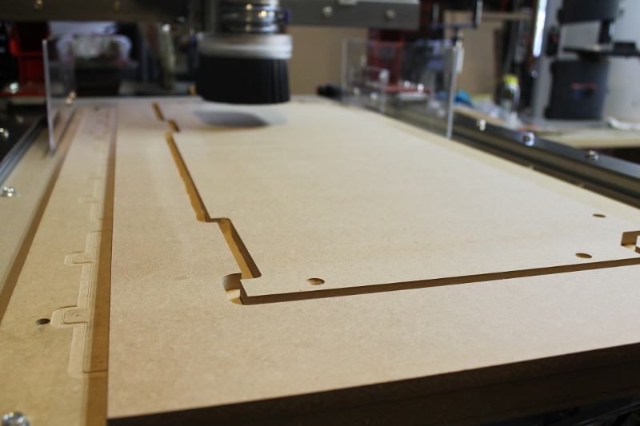
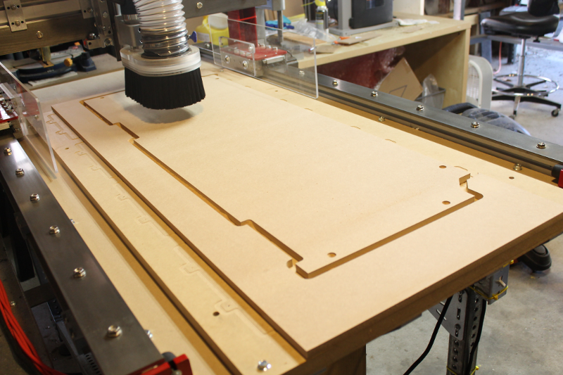
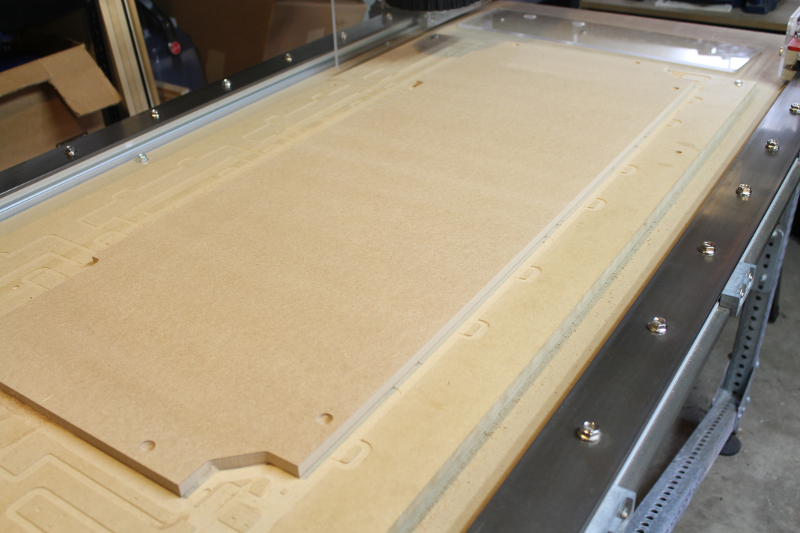
.. figure:: _static/floor_4.png
   :align:  center

   

Placing floors in the laser cutter frame
------------------------------------------

.. figure:: _static/floor_5.png
   :align:  center
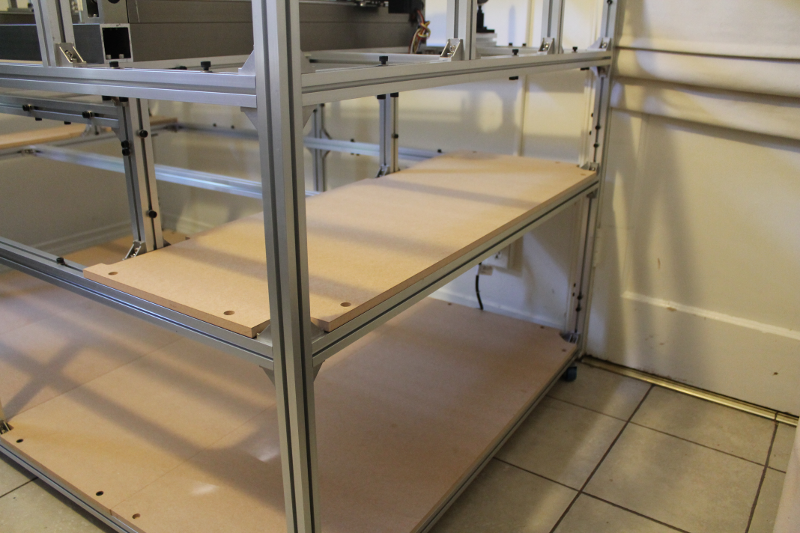

   
Additional images with floors and sides in place
----------------------------------------------------
   

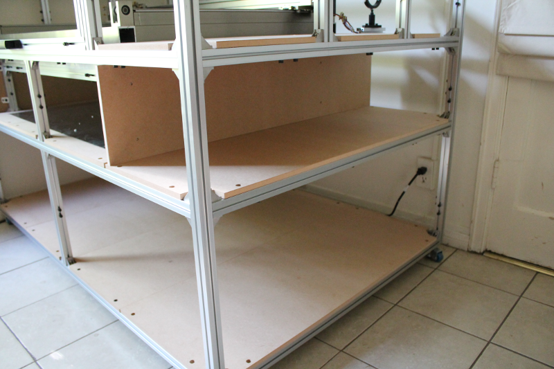
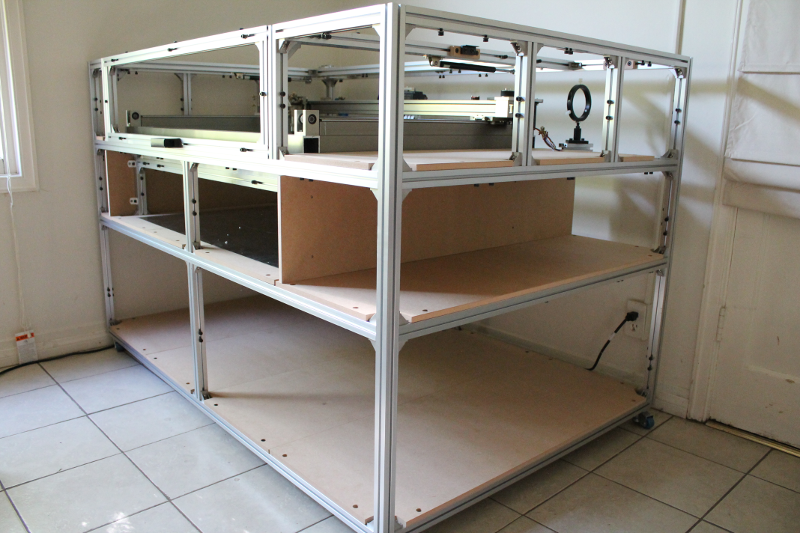

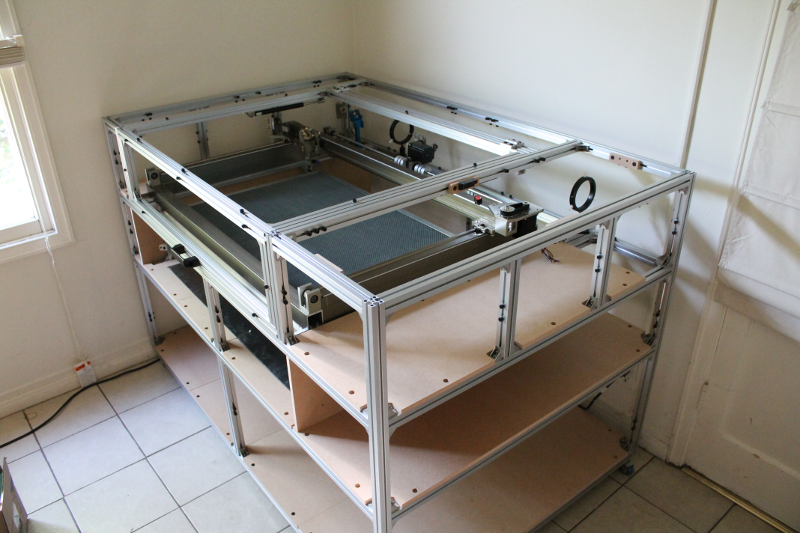
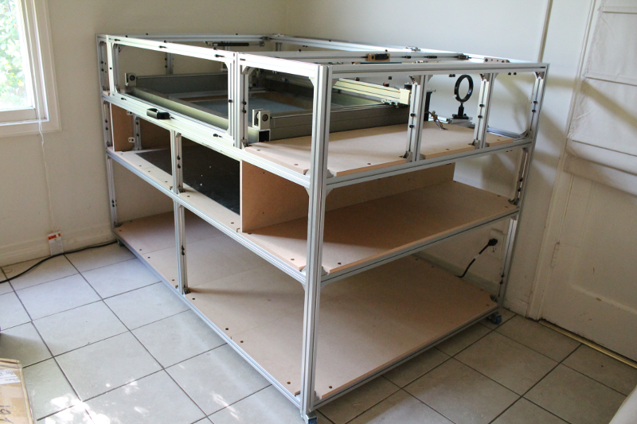
.. figure:: _static/floors_7.png
   :align:  center
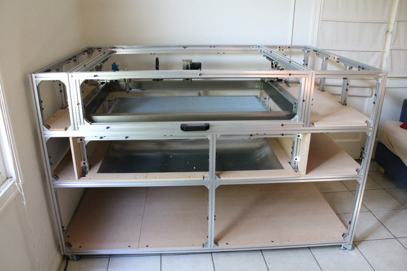
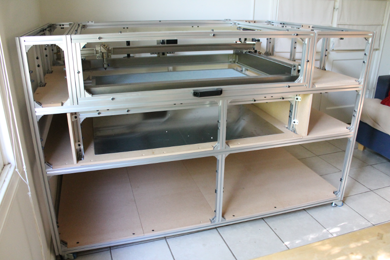

   
The honeycomb and aluminum sheet were also placed into the frame at this point.

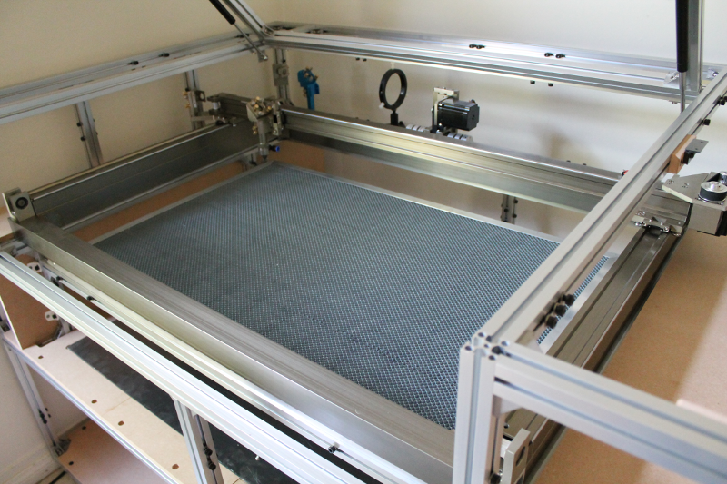

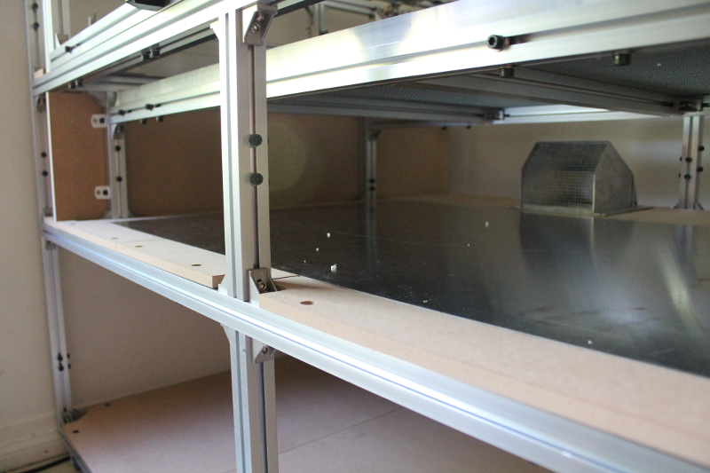
