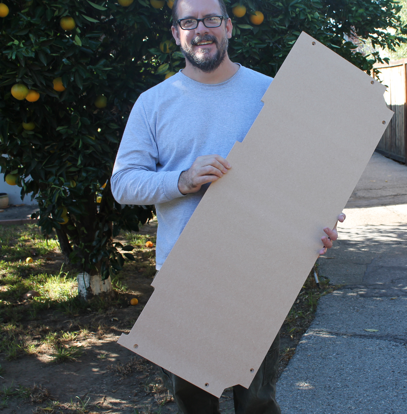

Custom frame floors and interior walls
=======================================

Machining the MDF with CNC router 
------------------------------------

.. figure:: _static/floor_1.png
   :align:  center
.. figure:: _static/floor_2.png
   :align:  center
.. figure:: _static/floor_3.png
   :align:  center

   

Placing floors in the laser cutter frame
------------------------------------------

.. figure:: _static/floor_5.png
   :align:  center

   
Additional images with floors and sides in place
----------------------------------------------------
   

.. figure:: _static/floors_1.png
   :align:  center
.. figure:: _static/floors_5.png
   :align:  center

.. figure:: _static/floors_3.png
   :align:  center
.. figure:: _static/floors_4.png
   :align:  center
.. figure:: _static/floors_7.png
   :align:  center

   
The honeycomb and aluminum sheet were also placed into the frame at this point.

.. figure:: _static/floors_2.png
   :align:  center

