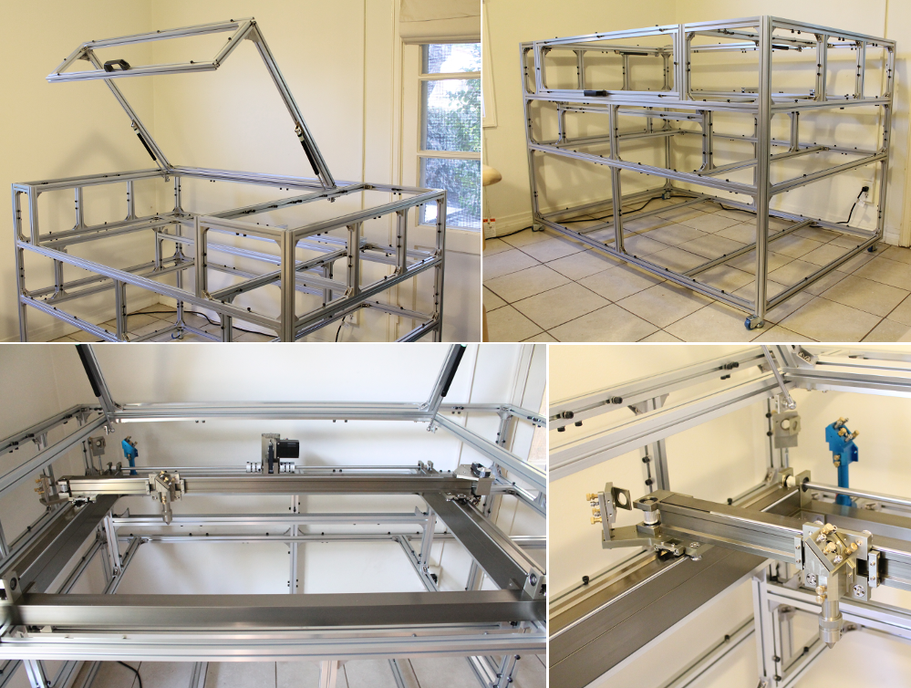

.. Laser Cutter Build documentation master file, created by
   sphinx-quickstart on Wed Oct  8 11:19:39 2014.
   You can adapt this file completely to your liking, but it should at least
   contain the root `toctree` directive.

Documentation site for our build of a medium sized laser cutter with a 900 mm x 600 mm cutting bed size and 80 W Reci Laser. 
   

   
Table of Contents
==============================================

Parts List
------------

.. toctree::
   :maxdepth: 2

   hardware.rst

Build Images
---------------------
We will be adding images here as we go through the laser cutter build.

.. toctree::
   :maxdepth: 2

   frame_build_1.rst
   stage_build.rst
.. laser_images.rst

